# Remote Finder

A macOS Finder–style file manager for a remote Linux machine, in the browser. Run it on your
server, reach it through an SSH tunnel, and browse the whole filesystem: open files in new tabs,
read the head or tail of multi-GB logs, grep and follow them, edit configs, compress and extract,
upload, and drop into a terminal in the current folder.

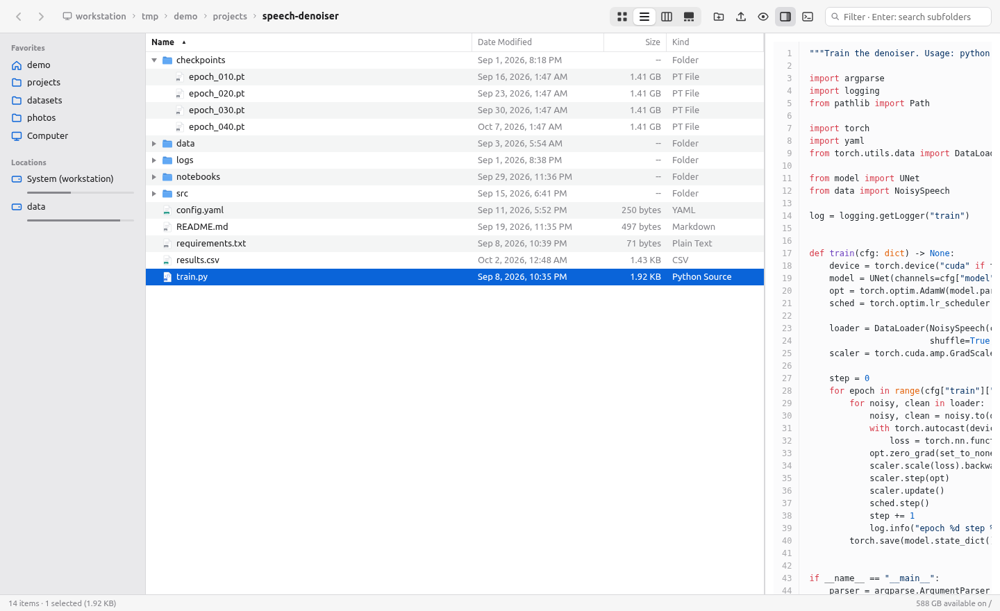

There is no login: it listens on `127.0.0.1` only and is meant to be used through `ssh -L`
(see [Security](#security-model)). The frontend has no build step.

## Features

- **Finder views:** Icons (with a size slider and image thumbnails), List (sortable columns,
  folders expand inline), Columns, and Gallery, plus a preview pane. Folders with 100k+ files stay
  fast because every view is virtualized.
- **Selection like Finder:** click, Ctrl/⌘-click, Shift-click ranges, rubber band in icon view,
  type-to-select, and Space for Quick Look.
- **Right-click menu:** Open / Open in New Tab, Head… / Tail…, Copy Path / Name / Parent Path,
  Download (folders and multiple items stream as a zip), Analyze Disk Usage, Compress (zip at maximum compression by
  default, or `.tar.xz` / `.tar.zst`, saved next to the files), Extract Here, Get Info, Calculate
  Size, Rename, Copy / Cut / Paste, Delete, Add to Sidebar, Open Terminal Here.
- **Open in a new tab:** syntax-highlighted code, a collapsible JSON tree, rendered Markdown,
  sortable CSV/TSV tables, Jupyter notebooks, images (arrow keys step through the folder), PDF,
  audio and video. Every page shows the full path, which you can copy or click through.
- **Head/tail tool for huge files:** any number of lines from the start or end, jump to a line or
  byte offset, regex grep (filter or highlight), and live follow (`tail -f`) that survives
  truncation and log rotation. Head, tail and byte offsets read only what they show, so 50 GB
  files open instantly; line jumps and grep scan the file once (line positions are cached).
- **Disk usage:** a graphical `du` for any folder (right-click › Analyze Disk Usage…). Rings or
  treemap next to a sortable tree with Size / Contents / Modified, filled in live while the scan runs
  and refined as it goes deeper. It counts like `du -x` (disk usage or apparent size, hardlinks
  once, one filesystem) and lists folders in parallel worker processes, so it usually finishes
  sooner than `du` itself. Nothing is ever deleted: **Archive** (Delete key, with undo) hides an
  item and subtracts its size, and the archive list gives you a ready-made `rm` command to review
  and run yourself.
- **Editor:** CodeMirror with ⌘/Ctrl+S; saves are atomic and warn if the file changed on disk.
- **Terminal:** a login shell in the browser (xterm.js), docked at the bottom or on the side,
  resizable; "Open Terminal Here" `cd`s the running shell.
- **File operations:** new folder, rename in place, copy/move by clipboard or drag and drop, upload
  files or whole folders from the desktop, with Finder's Replace / Keep Both / Skip dialog.
- **Search:** typing filters the current folder, Enter searches subfolders, Ctrl+P is fuzzy quick
  open. No index is kept.
- **Also:** bookmarks in the sidebar, disks with free space, back/forward history, every folder has
  its own URL (open it in a new tab), auto-refresh when a folder changes, dark mode.

## Screenshots

| | |
|---|---|
| 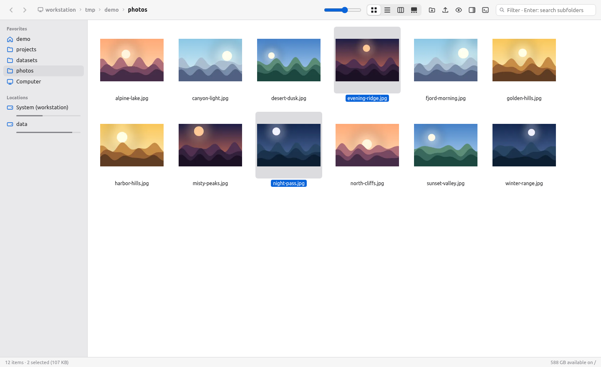 Icon view with thumbnails | 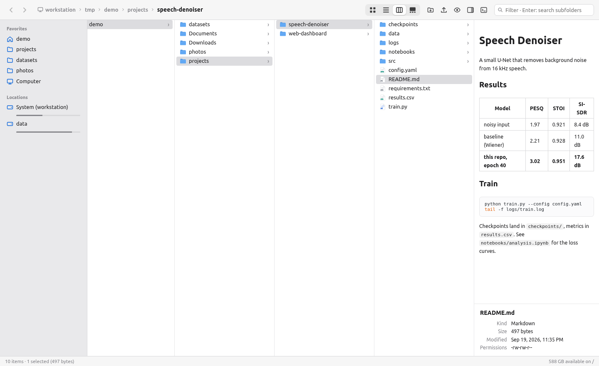 Columns view with a Markdown preview |
| 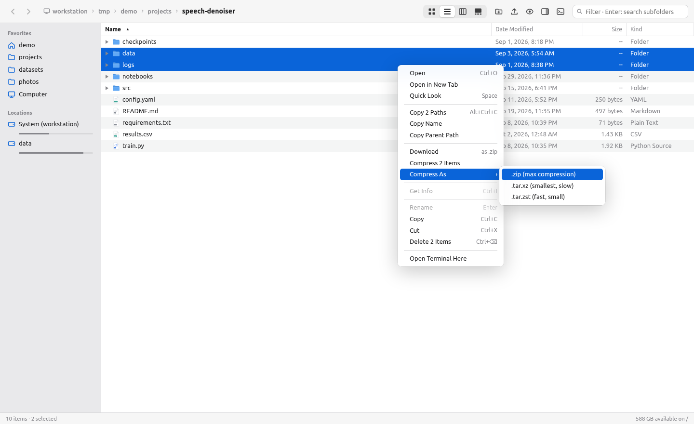 Right-click menu | 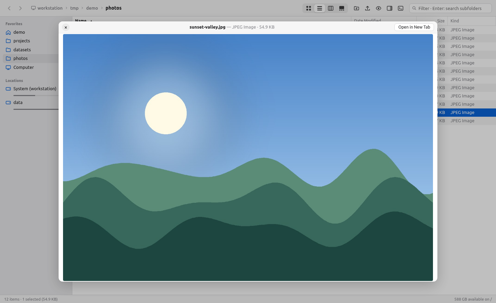 Quick Look (Space) |
| 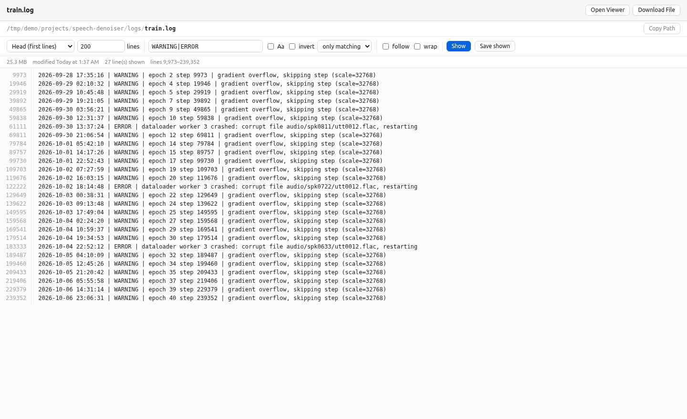 Head/tail tool: grep through a 26 MB log | 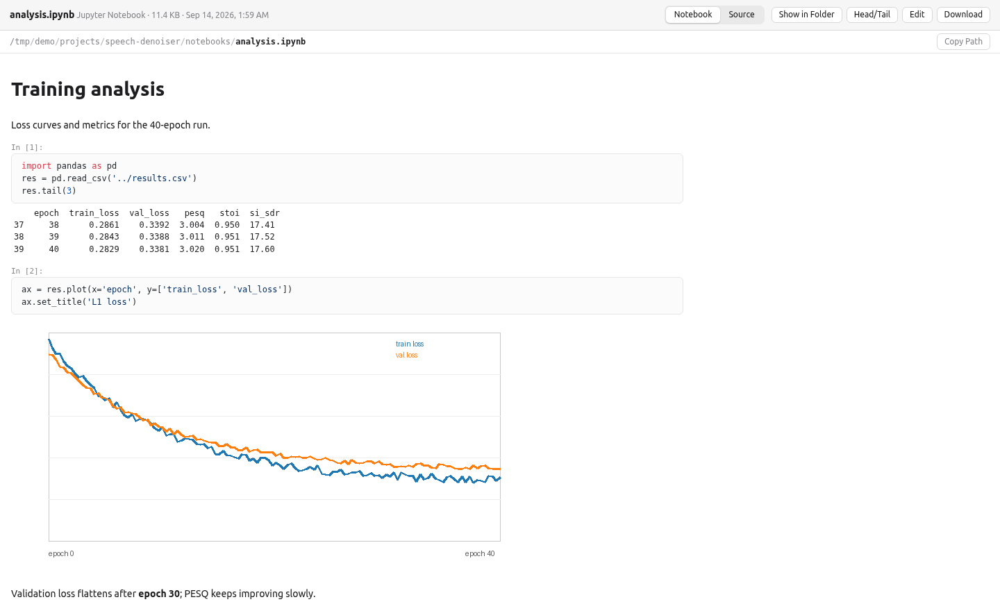 Notebook viewer |
| 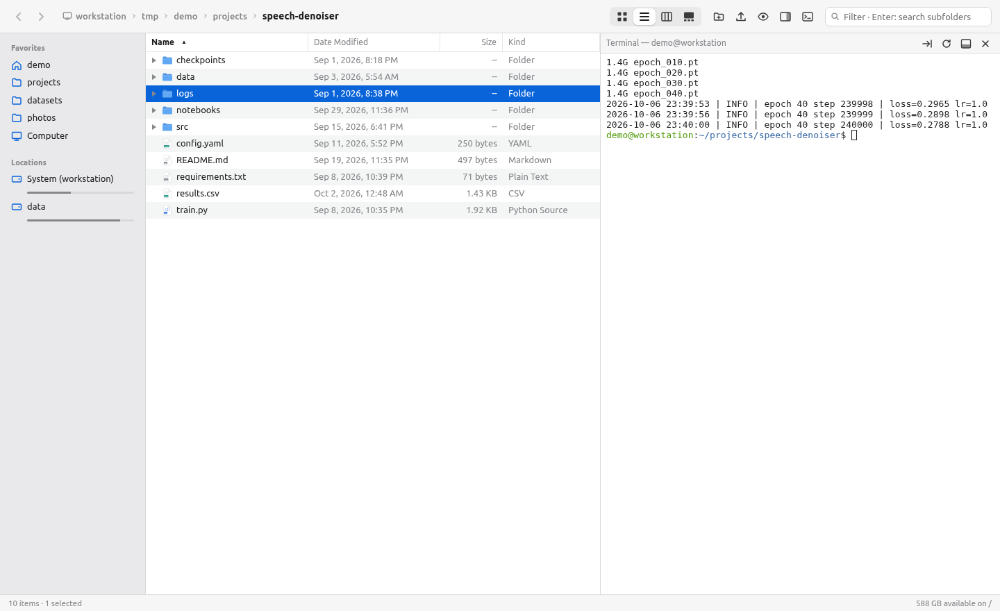 Terminal docked on the side | 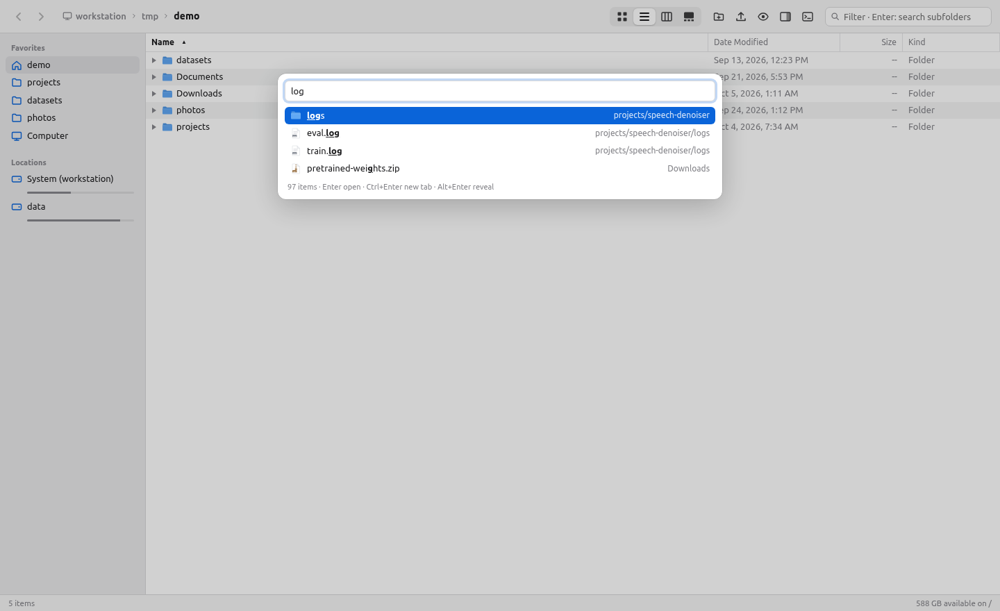 Quick open (Ctrl+P) |
| 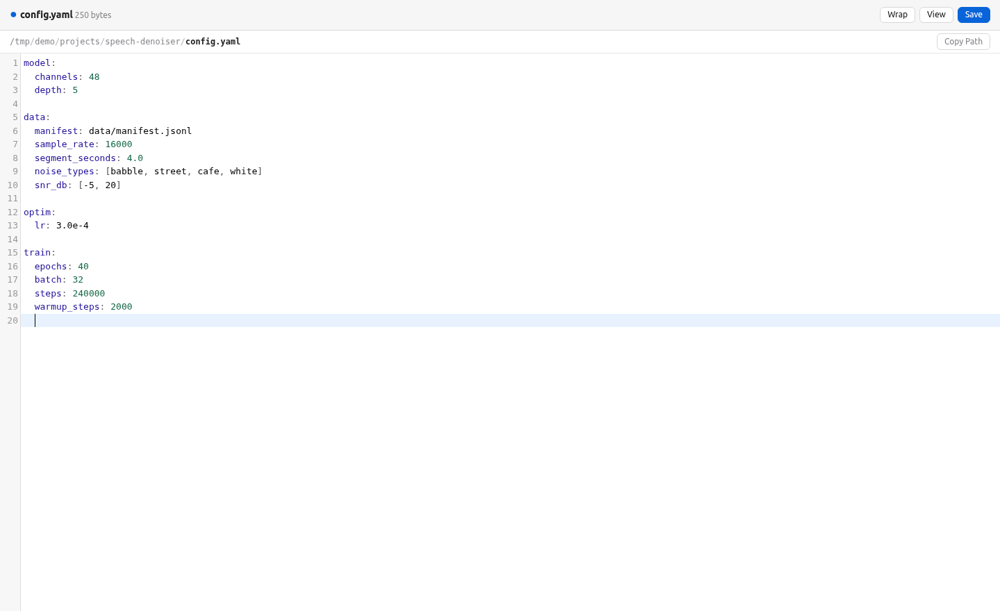 Editor | 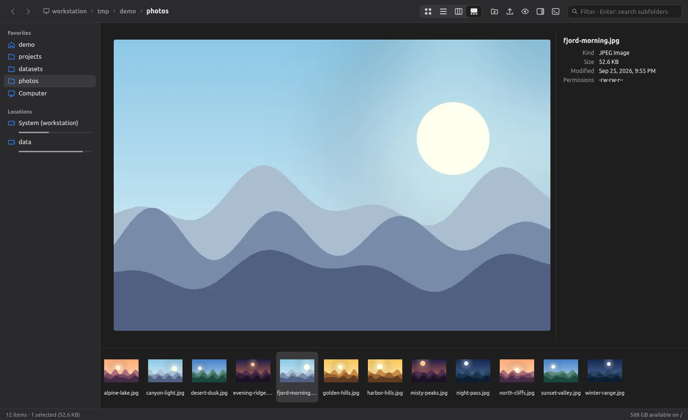 Gallery view, dark mode |

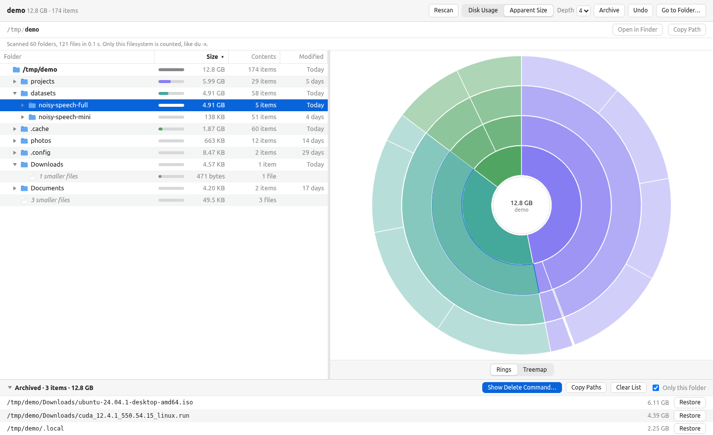
Disk usage analyzer with three items archived for cleanup (the demo's big files are sparse, so it shows apparent size)

## Quick start

Needs Linux, Python 3.10.12 or newer, and `xz` for `.tar.xz` archives.

```bash
git clone git@github.com:matevosashot/remote_finder.git ~/remote_finder
cd ~/remote_finder
python3.10 -m venv .venv
.venv/bin/pip install -r requirements.txt
./run.sh                                  # http://127.0.0.1:8090 (REMOTE_FINDER_PORT changes the port)
```

From your laptop, forward the port and open <http://localhost:8090>:

```bash
ssh -N -L 8090:127.0.0.1:8090 you@your-server
```

### Run it as a service

A systemd user unit is included (it expects the checkout at `~/remote_finder`):

```bash
mkdir -p ~/.config/systemd/user
cp scripts/remote-finder.service ~/.config/systemd/user/
systemctl --user daemon-reload
systemctl --user enable --now remote-finder
loginctl enable-linger "$USER"           # keep it running after you log out (may need admin rights)
journalctl --user -u remote-finder -f    # logs
```

The server runs as your user, so it can see and change exactly what you can.

## Keyboard

Ctrl means ⌘ on a Mac.

| Key | Action |
|---|---|
| Space | Quick Look |
| Enter | Rename |
| Ctrl+O / Ctrl+↓ / double-click | Open (Ctrl+double-click a folder: new tab) |
| Ctrl+↑ / Backspace | Enclosing folder |
| Ctrl+[ / Ctrl+] | Back / forward |
| Delete / Ctrl+Backspace | Delete (asks first; there is no trash) |
| Alt+Shift+N | New folder |
| Ctrl+C / X / V | Copy / cut / paste files |
| Ctrl+Alt+C | Copy path |
| Ctrl+I | Get Info |
| Ctrl+E | Edit |
| Alt+1…4 | Icons / List / Columns / Gallery |
| Ctrl+F or / | Filter / search |
| Ctrl+P | Quick open |
| Ctrl+Shift+G | Go to folder |
| Ctrl+Shift+. | Show hidden files |
| Ctrl+` | Terminal |

Browsers reserve Ctrl+1…9 and Ctrl+Shift+N, hence Alt for views and new folder.

On the disk usage page:

| Key | Action |
|---|---|
| ↑ / ↓, Shift for a range | Move the selection (Ctrl-click adds items) |
| → / ← | Expand / collapse a folder |
| Enter / double-click | Zoom into a folder (click the chart's center to zoom out) |
| Backspace / Ctrl+↑ | Zoom out |
| Delete / Ctrl+Backspace | Archive (hide and subtract; nothing is deleted) |
| Ctrl+Z / Ctrl+Shift+Z | Undo / redo archiving |
| Ctrl+Alt+C | Copy path |

## Security model

There is no authentication, and the app includes a shell, so it is locked down to your machine:

- The server binds to `127.0.0.1` only; reach it through an SSH tunnel.
- Requests whose `Host` isn't a loopback name are rejected, which blocks DNS rebinding.
- WebSockets (terminal, follow) and every change need an `Origin` matching the host.
- Changes also need an `X-Remote-Finder: 1` header. That forces a CORS preflight the server never
  approves, so websites open in your browser can't drive the API.
- Files are served with `Content-Security-Policy: sandbox` and `nosniff`. HTML and SVG show as
  source unless you pick the sandboxed render, so a file can't run script against the app.

Anyone who can open a connection to 127.0.0.1 on the server (other local users, too) can use it.
Run it only on a machine where that is acceptable.

Settings and bookmarks live in `~/.config/remote-finder/settings.json`, the disk usage archive list
in `~/.config/remote-finder/archive.json`, image thumbnails in `~/.cache/remote-finder/thumbs`.

## Development

```bash
.venv/bin/pip install -r requirements-dev.txt
.venv/bin/pytest -q tests                         # API tests, plus UI tests if Chrome is installed
.venv/bin/python scripts/make_screenshots.py      # rebuild docs/screenshots from a demo folder
.venv/bin/python scripts/make_screenshots.py --only disk-usage   # retake one, reusing the demo folder
```

The UI tests (`tests/test_ui.py`) drive the system Google Chrome or Chromium headlessly through
Playwright and are skipped if neither is installed. The screenshot script builds a fake home
folder in `/tmp/demo` and fakes the host name and disks, so no real machine details appear in the
images.

Frontend libraries are vendored in `static/vendor` (xterm.js, highlight.js, marked, DOMPurify,
CodeMirror 5, d3); `scripts/fetch_vendor.sh` re-downloads the pinned versions.

```
remote_finder/          FastAPI backend
  main.py               app assembly, static files, security middleware
  security.py           Host/Origin/CSRF-header checks, headers for serving user files
  config.py             app name, config/cache dirs, CSRF header name
  fsutil.py, models.py  shared filesystem helpers and request bodies
  fs_api.py             read-only: list, stat, raw, zip download, disks, folder size
  ops_api.py            mkdir, rename, delete, copy/move, upload, save
  archive_api.py        compress, extract, list archive contents
  text_api.py           head/tail/line/byte/grep on files of any size, WebSocket follow
  du_api.py, du_walk.py disk usage scan (live tree, worker processes), archive list
  search.py, thumbs.py  filename search and quick-open walk, image thumbnails
  terminal.py, jobs.py  pty terminal over WebSocket, background jobs with progress/cancel
  settings.py           bookmarks and view options
static/                 index/viewer/tail/editor/du pages, ES modules in js/, CSS, vendored libs
tests/                  pytest API tests and Playwright UI tests
scripts/                service unit, screenshot generator, vendor download
docs/screenshots/       README images
```
